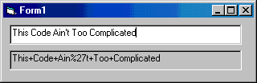

<div align="center">

## ServerDotURLEncode


</div>

### Description

Used by VB applications that want to lightly (without any additional project references) transform unsafe characters into web-friendly URL Encoded text.
 
### More Info
 
A string. Just start a new project with two text fields (Text1 and Text2) and paste the code into the form.

The URLEncoded version of that string. (Typically used when sending QueryString of Form data to web pages)


<span>             |<span>
---                |---
**Submitted On**   |
**By**             |[Rick Conklin](https://github.com/Planet-Source-Code/PSCIndex/blob/master/ByAuthor/rick-conklin.md)
**Level**          |Intermediate
**User Rating**    |4.5 (18 globes from 4 users)
**Compatibility**  |VB 3\.0, VB 4\.0 \(16\-bit\), VB 4\.0 \(32\-bit\), VB 5\.0, VB 6\.0
**Category**       |[String Manipulation](https://github.com/Planet-Source-Code/PSCIndex/blob/master/ByCategory/string-manipulation__1-5.md)
**World**          |[Visual Basic](https://github.com/Planet-Source-Code/PSCIndex/blob/master/ByWorld/visual-basic.md)
**Archive File**   |[](https://github.com/Planet-Source-Code/rick-conklin-serverdoturlencode__1-41639/archive/master.zip)


### Source Code

```
Function ServerDotURLEncode(strBefore As String) As String
 Dim strAfter As String
 Dim intLoop As Integer
 If Len(strBefore) > 0 Then
  For intLoop = 1 To Len(strBefore)
   Select Case Asc(Mid(strBefore, intLoop, 1))
   Case 48 To 57, 65 To 90, 97 To 122, 46, 45, 95, 42 '0-9, A-Z, a-z . - _ *
    strAfter = strAfter & Mid(strBefore, intLoop, 1)
   Case 32
    strAfter = strAfter & "+"
   Case Else
    strAfter = strAfter & "%" & Right("0" & Hex(Asc(Mid(strBefore, intLoop, 1))), 2)
   End Select
  Next
 End If
 ServerDotURLEncode = strAfter
End Function
Private Sub Text1_Change()
 Text2 = ServerDotURLEncode(Text1)
End Sub
```

